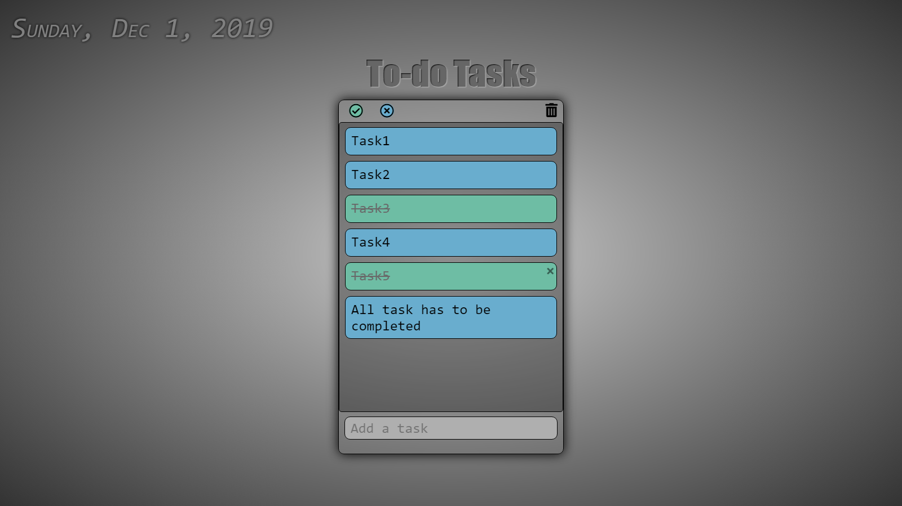

# To-do-Tasks

**Plain Javascript**

**View the project: [WEBPAGE](https://rkleet.github.io/To-do-Tasks/a.html)**

* The application user will see a list of tasks that he has to complete

* Every task will have two states: “Pending”, “Completed”, which can be shown using color codes (green for completed; blue for pending)

* By default, every task will be in “Pending” state

* On swiping right on a pending task item, that item moves to the completed state

* On swiping left on a completed task item, that item moves to the pending state

* States of the tasks is persisted, i.e., if we close the application and reopen it, the tasks which are completed and pending remains as it is; 
which is done by using localStorage.

